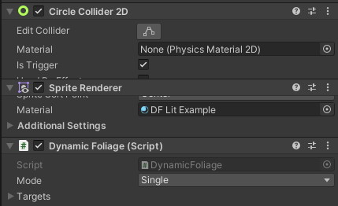

# Dynamic Foliage (Wind and Wiggle)

*v1; last update: 2020-08-26*

**Supports:** Scriptable Render Pipelines (URP, HDRP)

This combination of a script and shader allows sprites (intended for foliage) to move in the wind as well as to wiggle if an entity moves close.

 

### How it works

Both wind sway and wiggle movements are done using vertex displacement by the shader. The wind movement part is based on [the video by BinaryLunar](https://www.youtube.com/watch?v=aKzUsxLJ4SU). The dynamic wiggling when any entity is near is triggered by the *DynamicFoliage* script by setting the *StartTime* and *WiggleDirection* properties on the material. As the wiggle movement is smoothly added to the wind sway, there is no hard cut between those. After the wiggle has finished, the material is reset by the script.

Notes on batching: With URP/HDRP, all sprites using the same texture and material are batched and are drawn by the GPU in one call. Setting the wiggle parameters on the material effectively creates a new material instance, which adds one additional batch per wiggling element. However, after the wiggle (typically 1 or 2s), the material is reset so that the sprite can be batched again.

### Usage

Add one of the DF Lit/Unlit example materials below to your foliage sprite. This already enables the wind movement. For dynamic wiggling, you need to add any 2D collider, set it to *IsTrigger* and add the *DynamicFoliage* script.

You can adjust the wind and wiggle properties on the materials. To add variance, such as different wind strengths and speeds, you can create multiple materials from the shader and adjust their parameters. In the grass example above, the grass consists of two sprites, with the one in the background having lower wind and wiggle strengths.

If an entity consists of two or more sprites, you can save a bit of performance by adding both script and trigger to the parent element, set the mode to *Multiple*, and add the child renderers to the *Targets* array.

### Tips

If you notice sharp edges inside the sprite during wind movement, this may be due to overlapping vertices. This varies from sprite to sprite and typically happens for more concave forms, such as the grass above. To fix this, set the *Mesh Type* to *Full Rect* in the sprite's import settings.

### Files

-   [DynamicFoliage.cs](DynamicFoliage.cs)
-   [DynamicFoliageSubgraph.shadersubgraph](DynamicFoliageSubgraph.shadersubgraph)
-   [DynamicFoliageLit.shadergraph](DynamicFoliageLit.shadergraph)
-   [DynamicFoliageUnlit.shadergraph](DynamicFoliageUnlit.shadergraph)
-   [DF Lit Example.mat](DF%20Lit%20Example.mat) *(Example Material)*
-   [DF Unlit Example.mat](DF%20Unlit%20Example.mat) *(Example Material)*
