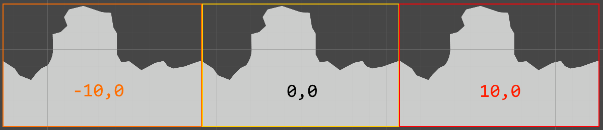

# Parallax (+ Infinite Scroll)

*v1; last update: 2020-08-11*

This is a more sophisticated implementation of a parallax effect (for the illusion of depth) that supports infinite scrolling of background layers and helps with the precise placement of background elements.

The code is based and expanded on the [great solution by David Dion-Paquet.](https://www.gamasutra.com/blogs/DavidDionPaquet/20140601/218766/Creating_a_parallax_system_in_Unity3D_is_harder_than_it_seems.php)

### Basic Usage

TL;DR: Add *Parallax Layer*, adjust *speedX*.

Add the *Parallax Layer* script to any objects you want to apply the effect to. It is recommended to group parallax elements by *layer* and put them below a parent object, to which you then add the script. While the impact on performance is minimal, it makes the organization of parallax speed values easier.

-   Far Background (with *Parallax Layer* script)
    -   FB 1
    -   ...
-   Background (with *Parallax Layer* script)
    -   B 1
    -   ...

Per layer, adjust the *speedX* (and *speedY*) parallax values. 0 ... no parallax, 1 ... moves with camera. For background layers that move slower than the main game layer, the values are typically between 0 and 1. For foreground layers that move faster, you can set the value to negative or check *Move in Opposite Direction*.

For the demo video above, we used the following values (from background to foreground): 0.8, 0.6, 0.4, -0.4.

Optionally, you can add the *Parallax Source* script to the target camera to enable parallax movement in edit mode ([see Precise Placement of Elements](#Precise-Placement-of-Elements)).

### Infinite Scrolling

To enable infinite scrolling, add the *Parallax Layer* script to an (empty) parent object, add at least three background child objects to it (typically sprites), and space them evenly next to each other. To prevent seams, each element should be wider than the camera width. If it is slimmer, you need to add additional elements. 

-   Scrolling (with *Parallax Layer* script)
    -   Left
    -   Center
    -   Right

### Precise Placement of Elements

With layers scrolling at different rates, it is not straightforward to have them align them in a certain way later in the level. We adopted the [solution by David Dion-Paquet](https://www.gamasutra.com/blogs/DavidDionPaquet/20140601/218766/Creating_a_parallax_system_in_Unity3D_is_harder_than_it_seems.php) and set the parallax script to be run in edit mode. For this, add the *Parallax Source* script to the target camera and check *Parallax in Edit Mode*. Now when you move the camera, the parallax layers scroll and you can adjust parallax elements in later sections of the scene. See David's video below for a visualization of this process. Additionally, by checking *Scene Movement*, in the *Parallax Source*, the camera can be moved using *Keypad:0 + Arrow Keys* in the scene view, even if something else than the camera is selected. This way, you do not need to alternate between selecting elements and the camera to move them.

### Files

-   [ParallaxLayer.cs](ParallaxLayer.cs)
-   [ParallaxSource.cs](ParallaxSource.cs)
