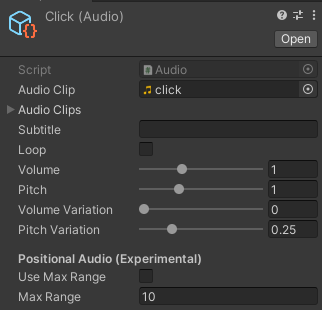
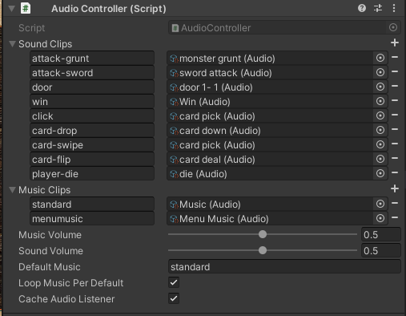

# Audio Controller

_v1; last update: 2021-05-07_

(Description will be expanded.)

This AudioController allows for easily playing sounds and music without having to add AudioSources to each GameObject that wants to play a sound. While not being a one-size-fits-all solution, it offers all features that are required for a typical jam game while providing an easy interface. The AudioController differentiates between music and sound playback.

Sounds can be added to a library and played by simply calling

```
AudioController.Instance.PlaySound("click");
```

This audio system needs the [Eazy Sound Manager](https://assetstore.unity.com/packages/tools/audio/eazy-sound-manager-71142) asset, which is **free**.

### Basic Usage

Install the [Eazy Sound Manager](https://assetstore.unity.com/packages/tools/audio/eazy-sound-manager-71142) asset, download and add the files below to your project.

For each sound/music file (.mp3, .ogg, etc.), you need to create a _Audio_ Scriptable Object in the project. Right click on the sound file and select _Create > Template > Audio From Clip_ and assign the AudioClip if it is not assigned automatically. While this step my feel cumbersome, it allows for easily normalizing the sound volumes, applying pitch variations, etc. You can also add multiple variants of a sound by adding those to the _SoundClips_ property. A random entry is then taken whenever this sound is played.



Create an AudioController **Prefab** with the _AudioController_ component and add it to your scene(s). On the prefab, build your **audio library** by adding entries to the _Sound Clips_ and _Music Clips_. Each entry is identified by a string name and the corresponding _Audio_ asset you created before. After adding some sounds and music, it may look like this:



Playing music/audio is done by:

```
AudioController.Instance.PlaySound("click");
// or
AudioController.Instance.PlayMusic("exploration-music");
```

### Files

**Please note:**
Unity currently (2020.2) does not support displaying Dictionaries in the inspector. The AudioController relies on a third-party implementation for serializing and displaying Dictionaries, for which three additional files are needed.

The dependence on the Singleton scripts will be removed in the future.

-   [**All files as ZIP**](AudioController.zip)
-   [Audio.cs](Audio.cs)
-   [AudioController.cs](AudioController.cs)
-   [Dictionaries.cs](Dictionaries.cs)
-   [SerializableDictionary.cs](SerializableDictionary.cs)
-   [SerializableDictionaryPropertyDrawer.cs](SerializableDictionaryPropertyDrawer.cs)
-   [Singleton.cs](Singleton.cs)
-   [PersistentSingleton.cs](PersistentSingleton.cs)
