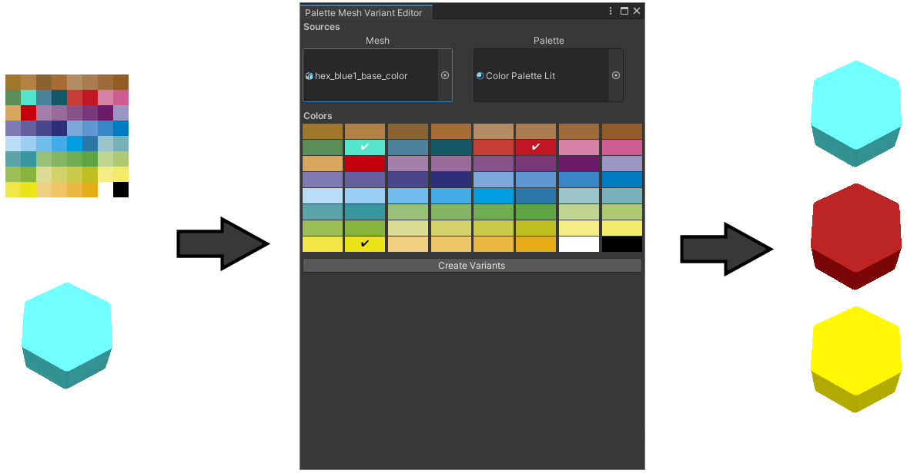

# Palette Mesh Variant Editor

*v1; last update: 2020-07-08*

This editor extension builds upon the concept of using a color palette for coloring low poly models, as described in the excellent videos and the [Click to Color extension](https://assetstore.unity.com/packages/tools/painting/click-to-color-72930) by One Wheel Studio:

The *Palette Mesh Variant Editor* introduces a custom create asset editor window (*Assets/Create/Palette Mesh Variant*) that can be used to create recolored variants of models directly in Unity. The original model is preserved. This is especially useful if you need to create multiple variants of a simple one-colored model, as it eliminates the tedious need to change the model's UVs in an external 3D modeling software, and exporting and importing the new model again.

*Note*: The Palette Mesh Variant Editor currently packs all the model's UVs into a single color segment of the palette. This means that multi-color assets are repainted with one color.

### Files
-   [PaletteMeshVariantEditor.cs](PaletteMeshVariantEditor.cs)
