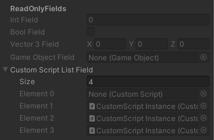

# ReadOnlyField Attribute

*v1; last update: 2020-07-09*

A simple attribute to make public fields and private serialized fields read-only. Works on all single-entity fields, arrays and lists. Only the size attribute of arrays and lists are currently editable.



### Usage

```csharp
[ReadOnlyField] public int intField;
[ReadOnlyField] public bool boolField;
[ReadOnlyField] public Vector3 vector3Field;
[ReadOnlyField] [SerializeField] private GameObject gameObjectField;
[ReadOnlyField] [SerializeField] private List<CustomScript> customScriptListField;
```

### Files
-   [ReadOnlyFieldAttribute.cs](ReadOnlyFieldAttribute.cs)

### Source

*ReadOnlyFieldAttribute.cs*

```csharp
using UnityEditor;
using UnityEngine;

public class ReadOnlyFieldAttribute : PropertyAttribute
{
}

#if UNITY_EDITOR
[CustomPropertyDrawer(typeof(ReadOnlyFieldAttribute))]
public class ReadOnlyFieldDrawer : PropertyDrawer
{
    public override float GetPropertyHeight(SerializedProperty property,
        GUIContent label)
    {
        return EditorGUI.GetPropertyHeight(property, label, true);
    }

    public override void OnGUI(Rect position,
        SerializedProperty property,
        GUIContent label)
    {
        GUI.enabled = false;
        EditorGUI.PropertyField(position, property, label, true);
        GUI.enabled = true;
    }
}
#endif
```